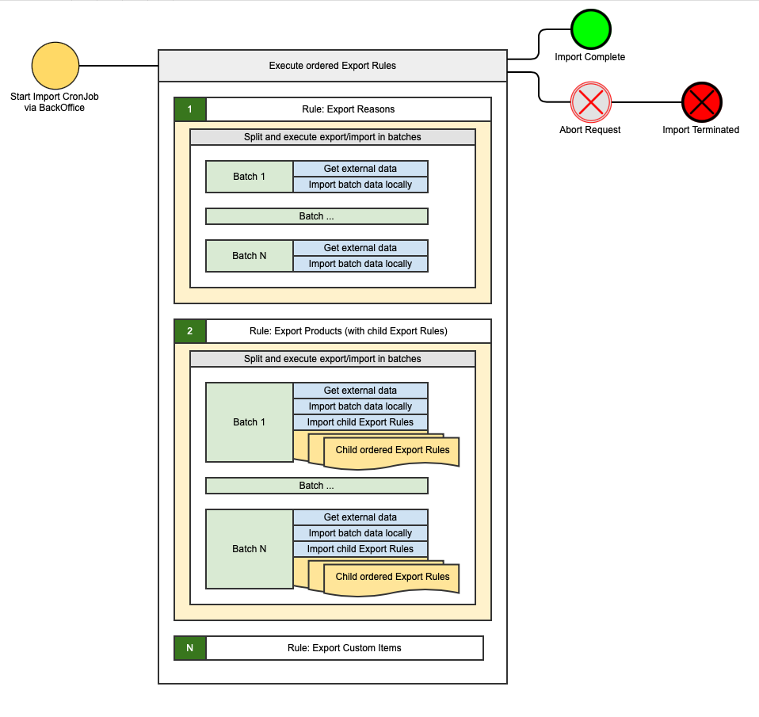

> ### Important
> - Omit selection of all items, try to define and use Export Rules only for required data
> - Execute only one Import simultaneously

## Quick start
- Checkout repository
- Start hybris
- Checkout project specific rules repository
- Via HAC impart import Profiles from project specific rules repository `profiles.impex`
- Open Backoffice and start newly created CronJob (search for `ImportDataCronJob`)
- check console log for progress, refresh cronjob via BO to be able to interrupt it

## Overview
Each import Profile has ordered list of Export Rules and specified URL will be used for getting external data.

Each Export Rule may have ordered child Export Rules, should have defined Flexible Search Query for getting external data, Impex header for importing data, Target Item type (hybris CompositeType), optionally: timeout, maximum amount of items for import, batch size for exporting.

During import each Export Rule will be executed in batches and if child Export Rules specified they will be executed for each parent's Export Rule batch with access to pks from the parent batch

## Rules
### Create new Export Rule

In the target environment create new item type of `EXPORTRULE`, define

- Unique name (user-friendly identifier - used only in logs & BackOffice)
- Timeout - request timeout which is used when requesting data for the Rule
- Batch size - amount of items requested/retrieved per each iteration of the Rule
- Max count - maximum amount of items requested for the Rule
- Target type - [y] item type used for default count query
- Export query - common FSQ used for exporting data
    - always select PK of the target type
    - each column in the select should have alias specified, it also should present in the `columns` field
    - if this is a Child Export Rule query should have where clause with filter by parent's Rule pks, parameter name `?pks`
    - for localized values use `:o` query
    - always add ORDER BY clause by `pk`
- Count query - custom count FSQ, usually used by child Export Rules as they have to know exact count based on PKs from parent's Rule iteration
    - if this is a Child Export Rule query should have where clause with filter by parent's Rule pks, parameter name `?pks`
- Import header - common Impex header library for importing data, can contain constants and extra variables
    - always specify reference column as a first one name of `&sourcePK`
- Parent export rules - ordered list of parent Export Rules
- Child export rules - ordered list of child Export Rules
- Columns - ordered list of columns defined Returned in Export Query and used by Import Header. Order is IMPORTANT
    - never add `PK` as column, it will be added by code

## Profiles
### Create new Import Profile

Each Import Profile is represented as a custom CronJob, in the target environment create new IMPORTDATACRONJOB, define:

- Unique code
- Job = `importDataJob` (springId = `importDataJobPerformable`)
- Source System Url - link to QA endpoint for Source environment (sample: `https://shop-dev.demagcranes.com/qa`)
- Ordered list of export rules

## Execute Import Profile

> ### Notes
>
> - Pre-conditions
>   - Export Rules and Import Profiles exists
> - There is possibility to abort running Export by stopping it via BackOffice or shutting down the target Application server

1. Open BackOffice → System → Background Processes → Cronjobs
1. Search and open CronJob name of your Export Profile (for example: DEVexportDataCronJob)
1. Start CronJob

